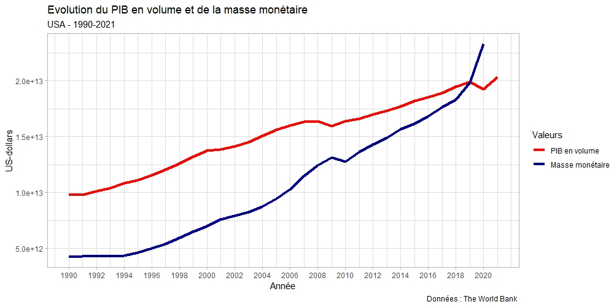
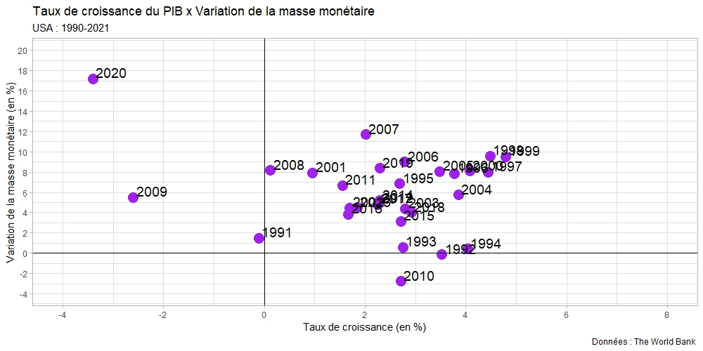
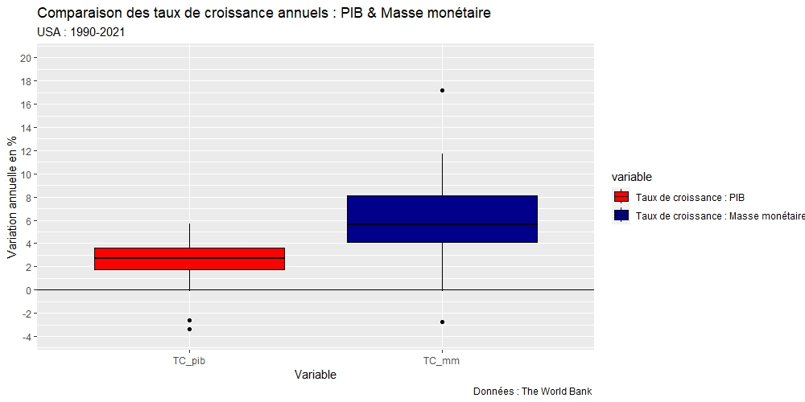

# Analysis of GDP and monetary supply fluctuations in the United States

### Project goal: 
Analysis of the fluctuations of the GDP and the monetary supply in the United States from 1990 to 2021, highlighting the relationship between these two macroeconomic variables. Data: World Bank.

### Statistical methods used:
Hodrick-Prescott filter, linear regressions

### Libraries used:
ggplot2, mFilter, tidyverse, reshape2.

### Examples of charts created:

